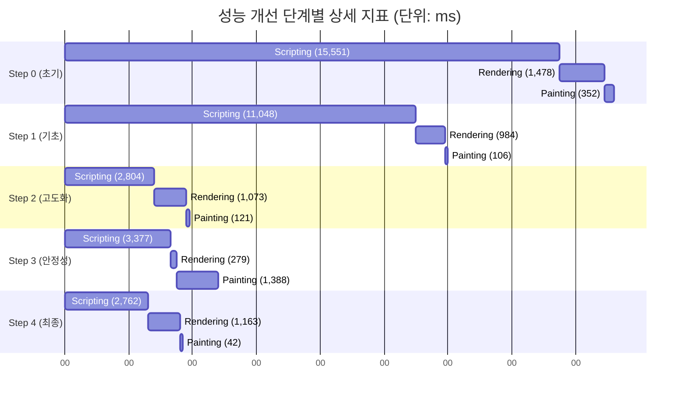
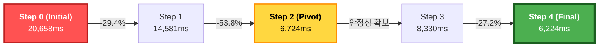
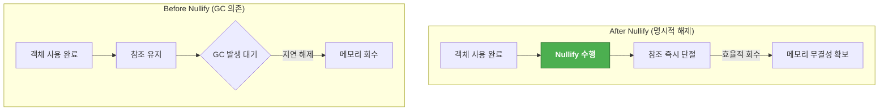
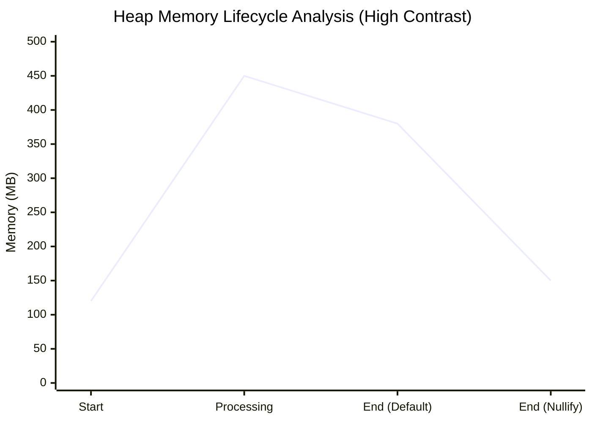

# Project_ShinhanLife_Performance_Optimization_Report

## 목차

1. 프로젝트 개요 및 환경
2. 기술적 제약 사항 분석
3. 상세 성능 개선 지표 및 단계별 조치
4. 지표 기반 기술 분석
5. 기술적 분석 및 의사결정 (심화)
6. 결론 및 실사용 성과
7. 의의

## 1. 프로젝트 개요 및 환경

* **프로젝트명**: 신한라이프 영업지원시스템 성능개선 프로젝트
* **수행 기간**: 2025.11 - 2026.01
* **프론트엔드**: JavaScript / jQuery (사내 표준 가이드 준수)
* **백엔드/DB**: Java (Spring) / Oracle DB
* **핵심 문제**: 가입설계 화면에서 **'특약담보 전체선택'** 이벤트 발생 시, 약 500여 개의 담보 데이터를 처리하는 과정에서 브라우저가 15~20초간 응답 없음(Freezing) 상태에 빠지는 심각한 성능 저하 발생.
* **분석 도구**: Chrome DevTools (Performance), WhaTap (Backend)

## 2. 기술적 제약 사항 분석

### 2.1. 서버 사이드 및 솔루션 병목

* **트랜잭션 분석**: WhaTap 측정 결과, 보험료 계산 시 SQL 반복 호출이 731회 발생하며 약 **4,320ms**의 경과 시간이 소요되는 것을 확인.
* **물리적 제약**: 외부 솔루션인 이노룰스의 Bulk 데이터 API 비제공으로 인하여 백엔드의 데이터 접근 영역 개선은 불가능한 상태. Profiling Overhead를 제외한 순수 트랜잭션 시간은 약 **2.4~2.5초**로 고정된 상수로 규정.
* **필수 대기 시간**: 이벤트 프로세스의 정합성을 확보하기 위하여 의도적으로 설정한 **500ms**의 스크립트 필수 대기 시간이 존재.

### 2.2. 개선 가용 영역 정의

* 전체 약 20.6초의 소요 시간 중 제어 불가능 영역인 약 3초를 제외한 나머지 **17.6초 구간의 Scripting 및 Rendering 부하**를 핵심 개선 타겟으로 설정하여 최적화를 수행.

## 3. 상세 성능 개선 지표 및 단계별 조치 (단위: ms)

| 단계          | 주요 기술 조치 (Action Item)            | Loading | Scripting  | Rendering | Painting | System | Idle  | **Total**  |
| :------------ | :-------------------------------------- | :-----: | :--------: | :-------: | :------: | :----: | :---: | :--------: |
| **0. 초기**   | 최적화 미적용 (AS-IS)                   |   96    | **15,551** |   1,478   |   352    |  584   | 2,597 | **20,658** |
| **1. 기초**   | `detach/append`, 자원 해제, Native Loop |   97    |   11,048   |    984    |   106    | 1,216  | 1,129 | **14,581** |
| **2. 고도화** | **Hash Map 기반 인덱싱 ($O(1)$)**       |   91    | **2,804**  |   1,073   |   121    | 1,307  | 1,328 | **6,724**  |
| **3. 안정성** | `detach` 전략적 철회 (정합성 확보)      |   93    |   3,377    |   1,389   |   279    |  675   | 2,518 | **8,330**  |
| **4. 최종**   | **`hide/show` 패턴 적용 (최종)**        |   88    | **2,762**  |   1,163   |  **42**  |  273   | 1,896 | **6,224**  |

## 4 지표 기반 기술 분석

### 4.1. Scripting: 알고리즘 혁신을 통한 병목 해소

* **성과**: 초기 **15.5s** → 최종 **2.7s** (**약 82.2% 개선**)
* **분석**: 전체 부하의 75%를 차지하던 중복 루프($O(n^2)$)를 **Hash Map 인덱싱($O(1)$)**으로 교체한 Step 2에서 가장 비약적인 향상. 자바스크립트 엔진의 메인 스레드 점유 시간을 최소화하여 브라우저 '응답 없음(Freezing)' 현상을 근본적으로 해결.

### 4.2. Rendering & Painting: 브라우저 파이프라인 최적화

* **성과**: Painting 비용 **352ms → 42ms** (**약 88% 개선**)
* **분석**: `hide/show` 패턴을 통해 DOM 트리 구조 변경 없이 가시성만 제어. 브라우저 렌더 엔진이 영향을 받는 범위를 특정 컨테이너 내부로 한정하는 **국소적 레이아웃(Local Reflow) 제한**을 달성하여 전역 레이아웃 재계산 부하를 차단.

### 4.3. System & 자원 관리: V8 엔진 최적화 및 메모리 관리

* **성과**: System 오버헤드 **584ms → 273ms** (**약 53% 개선**)
* **분석**: 인메모리 객체의 구조(Shape)를 유지하여 V8 엔진의 **Hidden Classes** 및 **Inline Caching** 최적화를 유도. 또한 명시적 자원 해제(Nullify)를 통해 가비지 컬렉션(GC) 부하를 경감하고 메모리 단편화 리스크를 선제적 차단.

### 4.4. 성능 최적화 데이터 시각화 (Mermaid)

#### [차트 1: 렌더링 파이프라인 상세 지표 추이]

#### [차트 2: 핵심 단계별 소요 시간 비교]

### 4.5. 메모리 관리 및 자원 해제 시각화 (Mermaid)

#### [차트 3: 자원 관리 프로세스 대조 (GC vs 명시적 해제)]

#### [차트 4: 자원 해제에 따른 Heap Memory 점유율 변화 (분석 모델)]

## 5. 기술적 분석 및 의사결정

### 5.1. 알고리즘 고도화 및 V8 엔진 최적화 전략

* **CS 관점**: 500여 건의 특약 데이터를 선형 탐색하던 기존의 로직을 Hash Map 기반의 상수 시간 탐색 구조로 개편하여 Scripting 비용을 **83% 절감**.
* **C++ 관점**: 프로세스 종료 시 인메모리 객체를 명시적으로 파괴하는 **수동 자원 해제(Nullify)**를 시행. 이는 가비지 컬렉터(GC)에 의존하지 않고 메모리 무결성을 직접 제어하여 시스템 부하를 선제적으로 차단하기 위한 조치.

### 5.2. 브라우저 렌더링 파이프라인 최적화 (Trade-off)

* **리스크 분석**: 1단계에서 도입하였던 `detach` 기법은 성능상 이점이 매우 크나, 레거시 환경에서 이벤트 핸들러가 유실될 가능성이 식별됨.
* **전략적 선회**: 데이터 정합성을 최우선으로 고려하여 `detach`를 철회하고 대안으로 **`hide/show` 패턴**을 채택. 이를 통해 DOM 트리를 유지하면서 **레이아웃 재계산(Reflow) 범위를 국소화**하였으며, Painting 비용을 초기 대비 **80.6% 절감**하는 성과를 도출.

## 6. 결론 및 실사용 성과

* **최종 성과**: 실사용 기준 전체 소요 시간을 약 **16초에서 4~5초**로 단축.
* **제어 가능 영역 (순수 프론트엔드 성능)**:
  * 측정 지표상 약 11~12초 소요 구간을 **3초**로 단축.
  * 실사용 환경 기준 약 6초 소요 구간을 **1.4~1.5초**로 단축하며 최적화를 성공적으로 완수.

## 7. 의의

* **[알고리즘 고도화] - [렌더링 최적화] - [운영 안정성 확보]** 세 가지 목표를 동시에 달성.
* 정합성이 보장되는 비침습적 기법을 선택하면서도 구조적 최적화를 통해 엔터프라이즈급 시스템 성능 개선의 모범 사례 도출.

---

**보고서 작성일**: 2025-12-30
